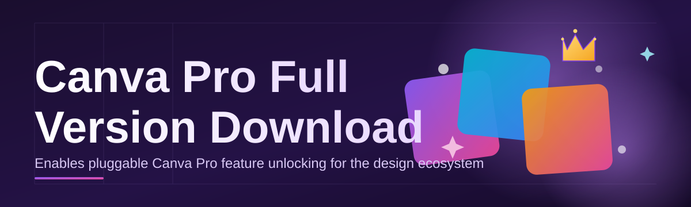

# canva-pro-suite-manager 🎨✨

  

*Your friendly local co-pilot for managing a full-featured Canva Pro workspace, without the guesswork.*

  

> [!TIP]
> New here? Skip straight to the **TL;DR** below, then jump to "How to Get Started" — you'll be up and running before your coffee gets cold. ☕

> **TL;DR**
> - 🚀 One tidy manager unlocks a smooth, full-feature Canva Pro workflow on Windows 10/11 — no clutter, no confusing menus.
> - 🧩 Standalone by design: no extra runtimes, no dependency chasing, just download and go.
> - 🎯 Built by design-tool tinkerers, for anyone who wants their Canva Pro full version download experience to feel effortless in 2026.

---

## 🌈 Overview

`canva-pro-suite-manager` is a lightweight desktop companion built for people who live inside Canva every day — social media managers, freelance designers, students, small business owners — and who want a clean, dependable way to manage a full Canva Pro suite setup on their own machine. Instead of hunting through scattered tutorials or juggling browser tabs, this project centralizes the whole "Canva Pro full version download" journey into one guided, transparent experience: fetch, verify, configure, launch.

The domain around Canva Pro full version download is honestly a mess online — broken links, outdated guides, mismatched Windows builds. This repo exists to fix that specific headache. We treat the download-and-setup flow like a proper piece of software: versioned, documented, testable, and open for anyone to inspect or improve. There's no black box here — every step of what the manager does is laid out in this README and in the codebase itself.

Who is this for? Content creators who need Canva Pro's premium templates and brand kit tools without friction. Small teams standardizing their design stack. Hobbyists curious how a suite manager is architected. If you've ever typed "Canva Pro full version download 2026" into a search bar and felt overwhelmed by the results, this project was built with you specifically in mind.

  

---

## 🔥 What Makes It Shine

- **One-click launch pad** — the moment you land on our page, everything funnels into a single, obvious action. No maze of buttons, no bait-and-switch download links.

- **Self-checking installer logic** — the manager quietly verifies file integrity before anything runs, so you're not left wondering if your Canva Pro full version download actually completed correctly.

- **Zero dependency baggage** — it doesn't ask you to install five other things first. Windows 10/11 and you're set.

- **Brand-kit aware defaults** — on first launch, the manager nudges your workspace toward Canva Pro's brand kit and premium template libraries so you're productive immediately.

- **Offline-friendly config cache** — once configured, core settings persist locally, so relaunching feels instant even on spotty connections.

- **Theme-adaptive interface** — light, dark, and an auto mode that follows your Windows theme setting.

- **Update-aware messaging** — the app tells you plainly when a newer 2026 build exists, instead of silently going stale.

- **Transparent logs panel** — curious what happened during setup? A built-in log viewer shows exactly what the manager did, step by step.

💬 Why "suite manager" and not just "downloader"?

Because a downloader implies you're done once the file lands on disk. This tool cares about the whole lifecycle — download, verify, configure, launch, and keep tidy — which is why we call it a manager. It's less "grab and pray" and more "grab, check, and go."

---

## 🧭 How to Get Started

> [!NOTE]
> This process takes about two minutes on a normal broadband connection. No technical background required.

1. **Visit the landing page** using the download button above or below — it's the only official source for this project.

2. **Download the standalone package** for Windows 10/11. There is nothing else to fetch separately.

3. **Run the manager** by double-clicking the downloaded file, then follow the on-screen setup wizard.

4. **Launch and personalize** — pick your theme, confirm your workspace folder, and you're ready to design.

> [!IMPORTANT]
> Always download from the official landing page linked in this README. Third-party mirrors claiming to host a "Canva Pro full version download" are not affiliated with this project and are not verified by us.

---

## 🖥️ System Requirements

| Component | Minimum | Recommended |
|---|---|---|
| **OS** | Windows 10 (64-bit) | Windows 11 (64-bit) |
| **RAM** | 4 GB | 8 GB or more |
| **Disk** | 500 MB free space | 1.5 GB free space |

  

---

## ⚙️ How It Works

The manager follows a deliberately simple pipeline — no hidden background processes, no mystery steps.

1. **Landing page request** — you click the download button, which takes you to the official page.

2. **Package fetch** — the standalone installer is retrieved as a single Windows binary.

3. **Integrity check** — a checksum pass confirms nothing got corrupted in transit.

4. **Local configuration** — your preferences (theme, workspace path) are written to a local config file.

5. **Launch** — the Canva Pro workspace manager opens, ready to use.

---

## 🩹 Troubleshooting

**Q: The download button doesn't seem to respond — what now?**
A: Give it a second try after refreshing the landing page; occasionally browser extensions block redirect badges. Disabling ad-blockers temporarily usually resolves it.

**Q: Windows SmartScreen flagged the installer. Is that normal?**
A: Yes — this happens with many newer, less widely-distributed applications. Click "More info," confirm the publisher matches this repository, and proceed if you trust the source.

**Q: My antivirus quarantined the file after the Canva Pro full version download completed.**
A: This can happen with heuristic-based scanners on new builds. Whitelist the file only if you downloaded it directly from the official landing page linked above.

**Q: The app opens but templates aren't loading.**
A: Check your internet connection — template libraries are fetched live from Canva's servers, so the manager itself can't cache everything offline.

**Q: Can I run this on macOS or Linux?**
A: Not currently. This build targets Windows 10/11 specifically; cross-platform support isn't on the near-term roadmap.

**Q: How do I fully reset my configuration?**
A: Open Settings → Advanced → Reset Local Config. This clears cached preferences without touching your design files.

---

## 🎛️ UI / UX Details

> [!TIP]
> Press `Ctrl + K` at any time to open the quick-command palette — it's the fastest way to jump between sections.

| Shortcut | Action |
|---|---|
| `Ctrl + K` | Open command palette |
| `Ctrl + ,` | Open Settings |
| `Ctrl + L` | Toggle logs panel |
| `Ctrl + Shift + T` | Cycle theme (Light / Dark / Auto) |
| `F5` | Refresh workspace status |

- **Themes**: Light, Dark, and Auto (follows Windows accent settings).
- **Settings panel**: workspace folder path, update-check frequency, log verbosity.
- **Notifications**: minimal, dismissible toast messages — no popup spam.

---

## 🤝 Contributing & Community

We welcome pull requests, issue reports, and honest feedback. This project grows stronger the more eyes are on it.

> [!NOTE]
> Before opening a PR, please check existing issues — there's a good chance someone's already discussing your idea.

- Fork the repository and create a feature branch.
- Keep changes focused — one topic per pull request.
- Describe *why* the change matters, not just *what* changed.
- Be kind in reviews. Everyone here is a volunteer.

Discussions, feature requests, and general chatter live in the Issues tab — join in, we don't bite. 🐙

---

## 📜 License

Released under the [MIT License](LICENSE), 2026. Use it, learn from it, remix it — just keep the license notice intact.

---

## ⚠️ Disclaimer

> [!WARNING]
> This project is an independent, community-built manager tool and is not affiliated with, endorsed by, or officially connected to Canva Pty Ltd. "Canva" and "Canva Pro" are trademarks of their respective owner. This README and repository make no guarantees about third-party service availability, pricing, or feature changes made by Canva outside of our control. Use this tool responsibly and in accordance with Canva's own terms of service.

  

